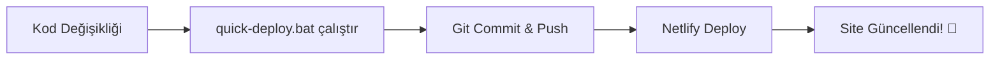

# 🚀 Netlify Otomatik Deploy Rehberi

Bu rehber [Bilgoo](https://github.com/veteroner/bilgoo) quiz oyununuzu Netlify'a otomatik deploy etmeniz için hazırlanmıştır.

## 📋 Gereksinimler

1. **Node.js** - [nodejs.org](https://nodejs.org) adresinden indirin
2. **Git** - [git-scm.com](https://git-scm.com) adresinden indirin  
3. **Netlify Hesabı** - [netlify.com](https://netlify.com) adresinde ücretsiz hesap oluşturun

## 🛠️ Kurulum

### 1. İlk Kez Deploy (Tam Kurulum)

```batch
netlify-deploy.bat
```

Bu dosya:
- ✅ Netlify CLI kurulumunu kontrol eder
- ✅ GitHub repository bağlantısını kurar
- ✅ Netlify hesabınıza giriş yapar
- ✅ Yeni site oluşturur
- ✅ Production deploy yapar

### 2. Hızlı Deploy (Sonraki Kullanımlar)

```batch
quick-deploy.bat
```

Bu dosya:
- ⚡ Değişiklikleri Git'e commit eder
- ⚡ GitHub'a push yapar
- ⚡ Netlify'a deploy eder
- ⚡ Tarayıcıda siteyi açar

## 📁 Oluşturulan Dosyalar

- `netlify-deploy.bat` - Tam otomatik deploy sistemi
- `quick-deploy.bat` - Hızlı deploy için
- `netlify.toml` - Netlify konfigürasyonu
- `.netlify/` - Netlify site ayarları (otomatik oluşur)

## 🔧 Netlify.toml Özellikleri

```toml
[build]
  publish = "."                    # Tüm proje klasörü publish edilir
  functions = "netlify/functions"  # Serverless fonksiyonlar için

[[redirects]]
  from = "/*"
  to = "/index.html"              # SPA redirect (PWA desteği)
  status = 200

[[headers]]
  # PWA, güvenlik ve cache ayarları
```

## 🌐 Deploy Sonrası

Deploy başarılı olduktan sonra:

1. **Site URL'nizi alın:**
   ```bash
   netlify status
   ```

2. **Site ayarlarını görüntüleyin:**
   ```bash
   netlify open
   ```

3. **Custom domain ekleyin** (İsteğe bağlı):
   - Netlify dashboard'unuzda
   - Domain settings > Add custom domain

## 🔄 Otomatik Deploy Workflow



## ❗ Olası Hatalar ve Çözümleri

### 1. "netlify command not found"
```bash
npm install -g netlify-cli
```

### 2. "Not logged in"
```bash
netlify login
```

### 3. "No site found"
```bash
netlify init
```

### 4. Git hataları
```bash
git remote add origin https://github.com/veteroner/bilgoo.git
```

## 📊 Site Performansı

Netlify otomatik olarak sağlar:
- ✅ CDN (İçerik Dağıtım Ağı)
- ✅ HTTPS SSL sertifikası
- ✅ Gzip sıkıştırma
- ✅ Asset optimizasyonu
- ✅ PWA desteği

## 💡 İpuçları

1. **Hızlı güncellemeler için:**
   ```batch
   quick-deploy.bat
   ```

2. **Branch deploy:**
   ```bash
   netlify deploy --alias staging
   ```

3. **Local test:**
   ```bash
   netlify dev
   ```

4. **Site analytics:**
   ```bash
   netlify open:admin
   ```

## 🎯 Deploy Özeti

| Dosya | Açıklama | Kullanım |
|-------|----------|----------|
| `netlify-deploy.bat` | Tam kurulum | İlk deploy |
| `quick-deploy.bat` | Hızlı güncelleme | Günlük kullanım |
| `netlify.toml` | Site konfigürasyonu | Otomatik |

## 🌟 Site Linki

Deploy başarılı olduktan sonra siteniz şu formatta erişilebilir olacak:
```
https://[site-name].netlify.app
```

Custom domain ile:
```
https://bilgoo.com  (örnek)
```

---

**🎮 Bilgoo Quiz Oyunu başarıyla Netlify'da yayında!**

GitHub Repo: https://github.com/veteroner/bilgoo 